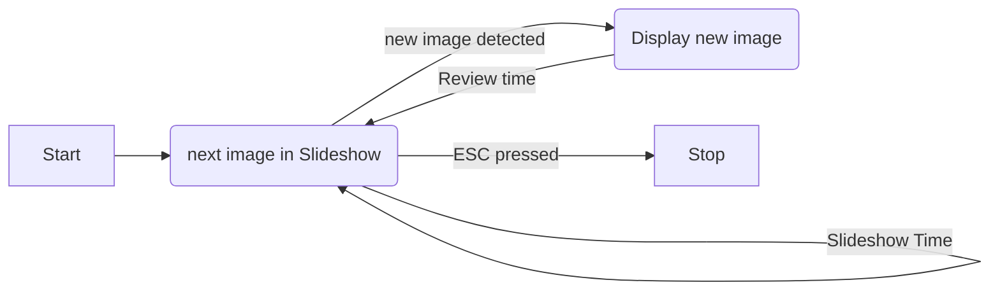
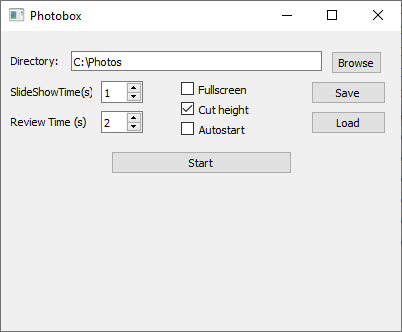

# Photobox
A little software for a Photobox Slideshow.

Photobox is monitoring a folder for new images. If a new image is detected it will be displayed 
imediately. After a specified time the Slideshow will continue displaying all the images in the
monitored folder. 




To automatically copy photos from a camera into a folder a tethered shooting software can be used:
- Under Windows EOS Uitility can be used for example. 
- In Linix gphoto2 turned out a good choice. It can be started like this:
```
 gphoto2 --port usb: --capture-tethered --filename "%y_%m_%d-%H_%M_%S-%n.%C
```
This will download the images to your PC. If you also want the store the images on the memory card 
of your camera you can try this one: 
```
 gphoto2 --port usb: --capture-tethered --keep --set-config capturetarget=card 
```

## Screenshot


 
## Build
### Linux

On Ubuntu and similar install QT like this:
``` shell
sudo apt-get install qt5-default qt5-qmake qtbase5-dev-tools
```

then switch to the directoy of the source an build the program with qmake:
``` shell
 qmake Photobox_Widget.pro
 make
 ./Photobox_Widget
```

### Windows

The easiest way to build on windows is to install QtCreator and open/compile the project there.

 
 
## Parameters
* Directory: Images contained in this path will be shown. This path is also watched for new images.
* SlideShow time: Images are displayed this long in the SlideShow.
* Review Time: A new image is displayed this long. After this time is expired the sliedshow will 
  continue.
* Fullscreen: The image will be shown in Fullscreen if checked.
* Cut Height: If the image is to tall it will be cut on the top and bottom. This is usefull when
  displaying 3:2 images on a widescreen monitor.
  
